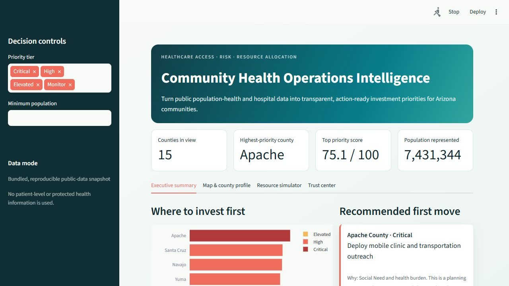
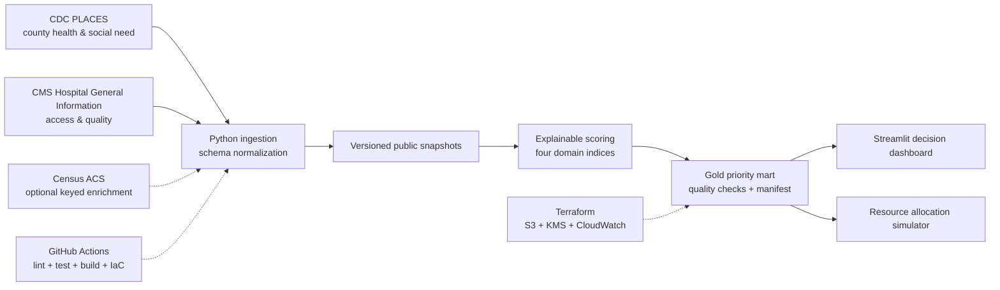

# Community Health Operations Intelligence

[](https://www.python.org/)
[](https://streamlit.io/)
[](https://www.terraform.io/)
[](#data-governance)

An enterprise-style decision intelligence platform that helps healthcare leaders answer:

> Where should we invest outreach, care coordination, mobile-clinic resources, or grant
> funding first?

The MVP joins public CDC population-health estimates, Census ACS socioeconomic measures, and
CMS hospital access and quality data; produces an explainable priority score for every Arizona
county; and turns the result into recommended actions and a budget-aware allocation scenario.



## Decision product

- Ranks all 15 Arizona counties across health burden, social need, care access, and hospital gap.
- Explains the two strongest drivers behind every recommendation.
- Maps priority and opens a county-level health/access profile.
- Allocates a configurable budget without overspending it.
- Surfaces missing hospital-rating data as uncertainty—not as poor quality.
- Runs six automated data-quality controls and records build metadata.
- Uses only public, aggregate data; no patient-level data or PHI is present.

## Quick start

```bash
python -m venv .venv
# Windows: .venv\Scripts\activate
# macOS/Linux: source .venv/bin/activate
python -m pip install -e ".[dev]"
python -m healthcare_di.pipeline
streamlit run dashboard/app.py
```

Open `http://localhost:8501`. The default uses committed public-data snapshots, so the demo is
reproducible and works without API credentials.

With Docker:

```bash
docker compose up --build
```

## Architecture



Detailed lineage and architectural decisions are in [architecture/](architecture/).

## Transparent scoring

All inputs are converted to within-state rank percentiles (0–100) before weighting, which keeps
different units comparable and makes the result easy to audit.

| Domain | Inputs | Overall weight |
|---|---|---:|
| Health burden | Obesity, diabetes, hypertension, poor physical health, poor mental health | 35% |
| Social need | Poverty, food insecurity, lack of insurance, inverse median household income | 25% |
| Care access | Transportation barriers, low annual-checkup rate, low hospital density | 25% |
| Hospital gap | Inverse CMS average star rating; neutral-high uncertainty score when unavailable | 15% |

The weighted index is a planning heuristic—not a causal model or a clinical risk score. See the
[model card](ml/model_cards/community_priority_score.md) for intended use, limitations, and
validation requirements.

## Public sources

| Source | Dataset | Included snapshot |
|---|---|---|
| CDC PLACES | County GIS-Friendly Format, 2025 release (`i46a-9kgh`) | Retrieved 2026-08-15 |
| CMS Provider Data Catalog | Hospital General Information (`xubh-q36u`) | Modified 2026-04-28; retrieved 2026-08-15 |
| Census ACS 5-year | 2020–2024 income and poverty estimates | Snapshot included; live refresh requires `CENSUS_API_KEY` |

Refresh the uncredentialed CDC/CMS sources:

```bash
python -m healthcare_di.pipeline --live
```

The live command can change scores as source agencies revise their data. Snapshot mode is the
default for review, tests, and portfolio demonstrations.

## Repository map

```text
dashboard/                 Executive decision application
src/healthcare_di/         Ingestion, scoring, quality, and pipeline code
data/snapshots/            Reproducible public aggregate inputs
data/gold/                 Generated decision mart and quality evidence
data_contracts/            Source-level contracts
transformations/           dbt-ready analytics models
database/                  PostgreSQL warehouse schema
infra/terraform/           Safe-by-default AWS foundation
architecture/              Diagram, lineage, and ADRs
ml/model_cards/            Model governance
portfolio/                 Portfolio-ready case study and project card
tests/                     Unit and contract tests
```

## Validation

```bash
ruff check .
pytest
python -m healthcare_di.pipeline
terraform -chdir=infra/terraform fmt -check -recursive
terraform -chdir=infra/terraform init -backend=false
terraform -chdir=infra/terraform validate
docker build -t community-health-intelligence .
```

GitHub Actions runs the Python, data build, Terraform, and container checks on every pull request.

## AWS foundation

Terraform defines a versioned, KMS-encrypted S3 data lake and encrypted CloudWatch log group.
Cloud resources are disabled by default to prevent accidental spend. Review the plan, set a
globally unique bucket name, and explicitly opt in:

```bash
terraform -chdir=infra/terraform init
terraform -chdir=infra/terraform plan \
  -var="deploy_cloud_resources=true" \
  -var="data_lake_bucket_name=YOUR-GLOBALLY-UNIQUE-NAME"
```

No `terraform apply` is run by CI.

## Data governance

- Public aggregate datasets only; PHI is prohibited by contract.
- Source IDs, vintages, retrieval dates, and lineage are recorded.
- County FIPS is the canonical geographic key; name normalization is limited to the CMS join.
- Missingness is visible in the dashboard and model output.
- Recommendations require local validation and community input before operational use.
- This project is a planning demonstration, not medical advice.

## Portfolio story

See [portfolio/CASE_STUDY.md](portfolio/CASE_STUDY.md) for interview-ready impact, engineering
decisions, and résumé bullets. The project intentionally shows healthcare analytics, data
engineering, explainable modeling, DevOps, and governance in one coherent product.

## Roadmap

- Census ACS enrichment after a key is configured.
- HRSA shortage-area measures and provider workforce capacity.
- ZCTA-level drill-down for Maricopa County.
- Maternal/infant health module using CDC WONDER Natality.
- Athena catalog and container hosting after an approved AWS cost review.

## License

MIT. Source datasets remain subject to their agencies' terms and attribution guidance.
