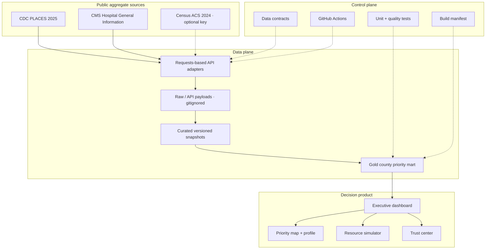

# Architecture

The MVP separates source retrieval, reproducible snapshots, deterministic transformations, and
decision presentation. This keeps the user-facing product available even when a government API
is slow or changes.

## Deployment boundary

Local and CI runs use committed snapshots. Terraform provides an opt-in S3/KMS/CloudWatch
foundation. Compute deployment is deliberately excluded from automatic CI until costs,
authentication, network boundaries, and an AWS account are approved.
